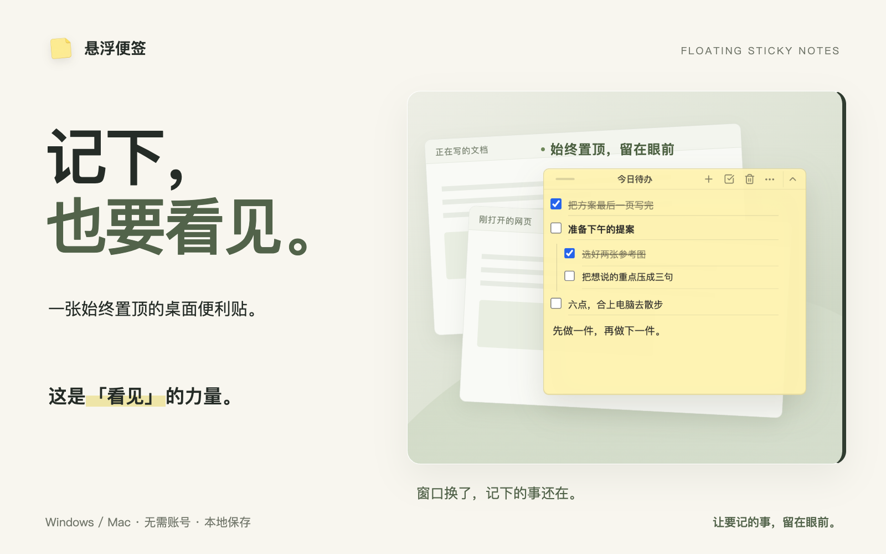
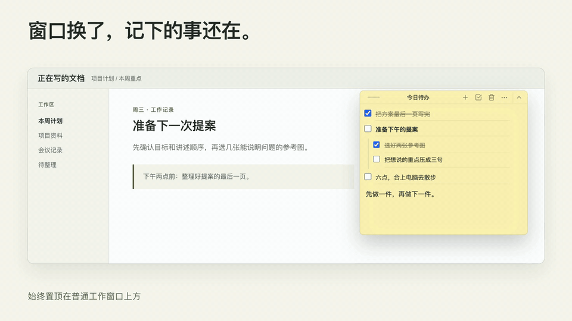
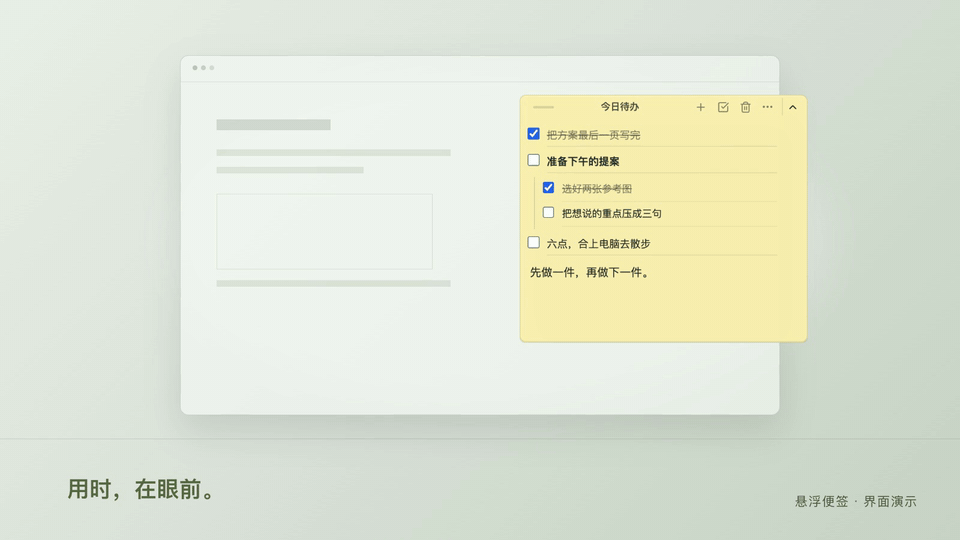
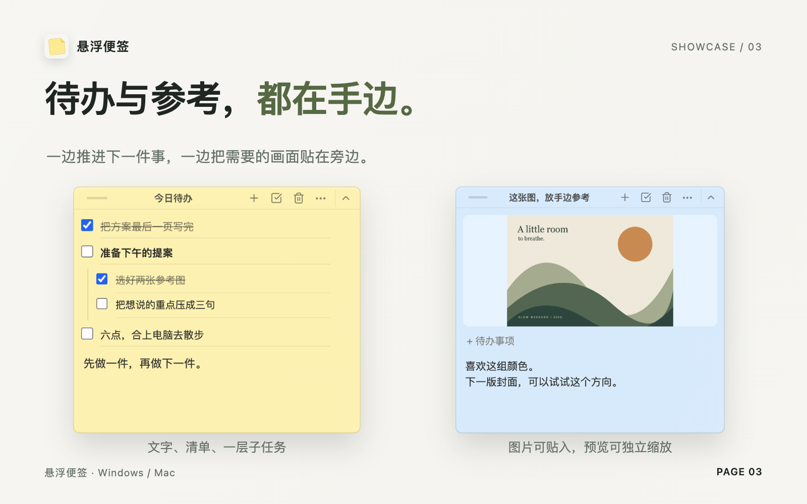

# 悬浮便签

一张始终置顶的桌面便利贴。无需账号，本地保存。



<p align="center">
  <a href="https://github.com/LawrenceChiu95/floating-sticky-notes-updates/releases/download/v0.1.21/StickyNotes-Setup-0.1.21.exe"><strong>下载 Windows 版</strong></a>
  &nbsp; · &nbsp;
  <a href="https://github.com/LawrenceChiu95/floating-sticky-notes-updates/releases/download/v0.1.21/StickyNotes-Mac-0.1.21.dmg"><strong>下载 Mac 版</strong></a>
</p>

## 这是「看见」的力量

便利贴贴在眼前，书签露在书页外。每次看见，都是一次重新想起的机会。

悬浮便签把这个习惯带到电脑上：它持续显示在普通工作窗口上方。切换文档、打开网页时，刚才记下的事仍然看得见。



## 留在眼前，也懂得让开

需要给工作腾出地方，点一下收成标题横条，再拖到屏幕边上，留下一枚小书签。

**鼠标移上去，书签探出来；拖回桌面，完整便签展开。**



## 待办、灵感和参考图



- **想做的事。** 写成待办，拆一层子任务，边做边勾。
- **忽然的灵感。** 随手记两句，给每张便签命名，选喜欢的颜色与透明度。
- **正在参考的图。** 粘贴截图或拖入图片，点击打开独立预览，支持缩放、移动和多图切换。

便签和图片只保存在当前电脑，不会同步到其他设备。重新打开时，内容与窗口位置都会恢复。

<sub>画面使用真实产品截图与虚构内容，动效为界面演示，非系统录屏。</sub>

## 安装

当前版本 **[0.1.21](https://github.com/LawrenceChiu95/floating-sticky-notes/releases/tag/v0.1.21)**，免费下载。 [更新记录](CHANGELOG.md)

- **Windows x64**：下载后运行安装程序。安装包暂未签名，系统可能提示“未知发布者”。
- **Mac（Apple Silicon）**：打开安装包，将应用拖入 Applications。当前版本尚未公证，首次打开若被系统阻止，可在“系统设置 → 隐私与安全性”中选择“仍要打开”。

可从托盘菜单检查更新。Windows 支持应用内安装更新；Mac 下载新版安装包后，需要手动替换应用。

<details>
<summary><strong>便签存在哪里？更新后还在吗？</strong></summary>

便签和导入的图片保存在本机：

- Windows：`%APPDATA%\floating-sticky-notes`
- macOS：`~/Library/Application Support/floating-sticky-notes`

安装更新不会删除这个目录。卸载应用时也会保留本地便签，除非用户手动删除。

</details>

<details>
<summary><strong>开发与贡献</strong></summary>

环境要求：Node.js 22 / npm 10。

```bash
npm ci
npm run dev
```

[贡献指南](CONTRIBUTING.md) · [架构说明](docs/architecture.md) · [发布流程](docs/releasing.md) · [安全问题](SECURITY.md)

</details>

## 喜欢这张便签？

如果它对你有用，欢迎点一个 **Star ⭐**，支持我继续打磨。

由 [Lawrence](https://github.com/LawrenceChiu95) 制作 · [反馈与建议](https://github.com/LawrenceChiu95/floating-sticky-notes/issues/new/choose) · [MIT License](LICENSE)
