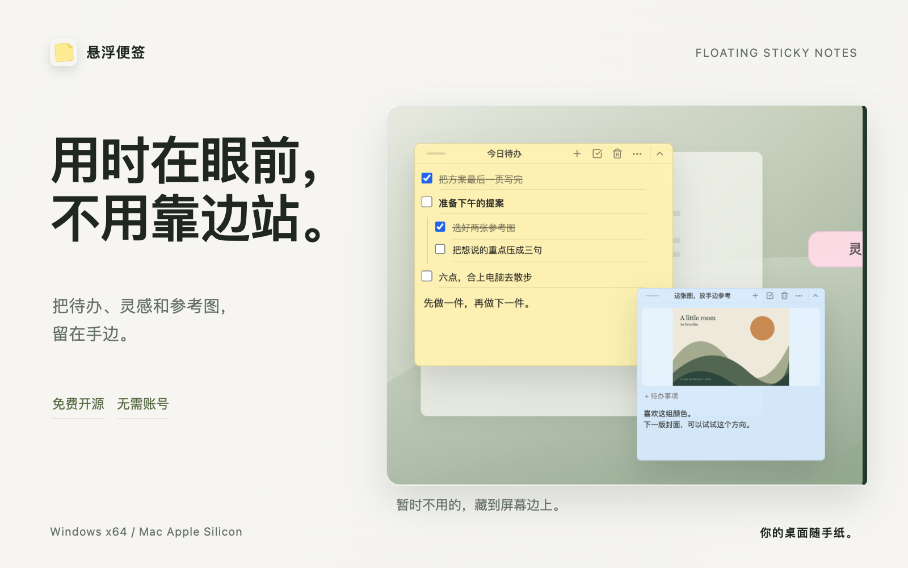

# 悬浮便签

**用时在眼前，不用靠边站。**

把待办、灵感和参考图留在手边的一张桌面便签。免费开源，支持 Windows 和 Apple Silicon Mac，无需注册。



<p align="center">
  <a href="https://github.com/LawrenceChiu95/floating-sticky-notes-updates/releases/download/v0.1.21/StickyNotes-Setup-0.1.21.exe"><strong>下载 Windows 版</strong></a>
  &nbsp; · &nbsp;
  <a href="https://github.com/LawrenceChiu95/floating-sticky-notes-updates/releases/download/v0.1.21/StickyNotes-Mac-0.1.21.dmg"><strong>下载 Mac 版</strong></a>
  &nbsp; · &nbsp;
  <a href="https://github.com/LawrenceChiu95/floating-sticky-notes-updates/releases/latest">所有安装包</a>
</p>

## 留在手边，也给桌面留白

需要时，便签持续显示在普通窗口上方。暂时不用，点一下收成标题横条，再拖到屏幕左边或右边，藏成一枚小书签。

**鼠标移上去，书签探出来；拖回桌面，完整便签展开。**


[查看清晰版短视频](../../assets/showcase/video/edge-dock.mp4)

## 待办、灵感、参考图，都有地方放


- **下一件事，一抬眼就看见。** 待办可以勾选，也能拆一层子任务；日常工作时留在窗口旁边。
- **刚想到的，先接住。** 随手记下文字，每张便签可以命名、换颜色、调透明度。
- **参考图，也留在手边。** 粘贴截图或拖入图片，点击打开独立预览，支持缩放、移动和多图切换。

便签和图片只保存在这台电脑。没有账号、云同步或遥测，重新打开会恢复内容与窗口位置。

<sub>图片取自 0.1.21 的真实应用界面，使用虚构演示内容；桌面场景与动效为排版合成，非原生操作录屏。</sub>

## 下载与安装

当前版本：**[0.1.21](https://github.com/LawrenceChiu95/floating-sticky-notes/releases/tag/v0.1.21)** · [更新记录](../../CHANGELOG.md)

| 你的电脑 | 安装包 | 首次安装 |
| --- | --- | --- |
| Windows x64 | [下载 Setup](https://github.com/LawrenceChiu95/floating-sticky-notes-updates/releases/download/v0.1.21/StickyNotes-Setup-0.1.21.exe) | 运行安装程序；安装包未签名，系统可能提示未知发布者 |
| Mac · Apple Silicon | [下载 DMG](https://github.com/LawrenceChiu95/floating-sticky-notes-updates/releases/download/v0.1.21/StickyNotes-Mac-0.1.21.dmg) | 打开后拖入 Applications；首次运行可能需在「系统设置 → 隐私与安全性」选择「仍要打开」 |

Windows 支持应用内检查、下载和重启安装更新；Mac 会下载并校验 DMG，再由你手动替换应用。Mac 构建使用完整 ad-hoc 签名，尚未使用 Apple Developer ID 或经过公证。

遇到问题，可以[提交反馈](https://github.com/LawrenceChiu95/floating-sticky-notes/issues/new/choose)。Windows 贴边拖出偶发不展开的问题已在本版修复相关逻辑，仍在收集[实际使用反馈](https://github.com/LawrenceChiu95/floating-sticky-notes/issues/27)。

<details>
<summary><strong>便签存在哪里？更新后还在吗？</strong></summary>

便签和导入的图片保存在本机：

- Windows：`%APPDATA%\floating-sticky-notes`
- macOS：`~/Library/Application Support/floating-sticky-notes`

安装更新不会删除这个目录。卸载应用时也会保留本地便签，除非用户手动删除。

托盘可以新建或恢复便签、设置开机启动、检查更新和退出应用。

</details>

<details>
<summary><strong>从源码运行与构建</strong></summary>

环境要求：Node.js 22 / npm 10。

```bash
npm ci
npm run dev
```

开发模式使用独立的 `floating-sticky-notes-dev` 数据目录，不影响同机正式版数据，两边可以同时运行。

```bash
npm test
npm run build
npx --yes npm@11 audit
```

项目使用 npm 10 安装依赖、npm 11 执行安全审计。修改依赖或 `overrides` 时，参见[贡献指南中的依赖维护流程](../../CONTRIBUTING.md#依赖维护)。当前依赖审计事项见 [Issue #23](https://github.com/LawrenceChiu95/floating-sticky-notes/issues/23)。

```bash
npm run dist:win  # Windows x64 NSIS Setup
npm run dist:mac  # Apple Silicon Mac DMG，ad-hoc 签名
```

Windows 只维护 Setup 安装包，不提供 portable 便携包。架构和发布流程见 [架构说明](../../docs/architecture.md)与[发布指南](../../docs/releasing.md)。

更新资源存放在 [floating-sticky-notes-updates](https://github.com/LawrenceChiu95/floating-sticky-notes-updates)；源码、Issue 和变更记录在本仓库维护。

</details>

## 一起把它做好

欢迎提交 Bug、建议和 Pull Request。[贡献指南](../../CONTRIBUTING.md) · [安全问题反馈](../../SECURITY.md) · [产品展示素材](../../docs/distribution/README.md)

本项目采用 MIT 许可证：[原文](../../LICENSE) · [中文参考译文](../../LICENSE.zh-CN.md)。
